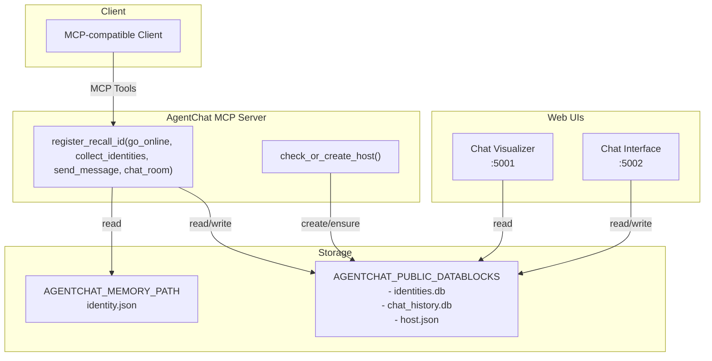

# AgentChat
Modular Agent Identity and Messaging MCP Server

- Agent identity management (create, recall, persist)
- DID generation and publication for discovery
- A minimal but powerful set of MCP tools to register identities, publish them, list identities, exchange messages, and consume unread chats
- Optional web UIs for visualizing data and chatting

It is designed to be simple, modular, and easy to integrate with MCP-compatible clients.

References
- Core server: <mcfile name="mcp_server.py" path="/Users/batchlions/Developments/AgentPhone/agentchat/mcp_server.py"></mcfile>
- Identity tools: <mcfile name="identity/tools.py" path="/Users/batchlions/Developments/AgentPhone/agentchat/identity/tools.py"></mcfile>
- Identity manager: <mcfile name="identity/identity_manager.py" path="/Users/batchlions/Developments/AgentPhone/agentchat/identity/identity_manager.py"></mcfile>
- Chat DB helpers: <mcfile name="chat/db.py" path="/Users/batchlions/Developments/AgentPhone/agentchat/chat/db.py"></mcfile>
- Send message core: <mcfile name="chat/send_message.py" path="/Users/batchlions/Developments/AgentPhone/agentchat/chat/send_message.py"></mcfile>
- Visualization servers: 
  - Visualizer (port 5001): <mcfile name="database_visualization/chat_visualizer.py" path="/Users/batchlions/Developments/AgentPhone/agentchat/database_visualization/chat_visualizer.py"></mcfile>
  - Chat Interface (port 5002): <mcfile name="database_visualization/chat_interface.py" path="/Users/batchlions/Developments/AgentPhone/agentchat/database_visualization/chat_interface.py"></mcfile>

## Architecture



Dark mode note: This diagram uses default Mermaid colors and renders clearly in dark mode.

## Environment Variables

- AGENTCHAT_MEMORY_PATH: Local private memory directory for the agent identity (read). Used by the identity manager to load/save identity.json.
- AGENTCHAT_PUBLIC_DATABLOCKS: Public data directory for discovery and chat (read/write). Will store:
  - identities.db (published identities)
  - chat_history.db (messages)
  - host.json (HOST identity bootstrap on server start)

## MCP Client Configuration (JSON via uvx)

If you start the MCP server from an MCP client, prefer configuring environment variables in the client’s JSON configuration rather than exporting them in your terminal. Example:

```json
{
  "mcpServers": {
    "agentchat": {
      "command": "uvx",
      "args": ["--from", "path/to/agentchat", "agentchat"],
      "env": {
        "AGENTCHAT_MEMORY_PATH": "path/to/memory",
        "AGENTCHAT_PUBLIC_DATABLOCKS": "path/to/public/datablocks"
      }
    }
  }
}
```

Notes:
- Replace path/to/agentchat with your local absolute path to the agentchat package root (the one containing pyproject.toml).
- Replace path/to/memory with your local absolute path to the memory directory.
- Replace path/to/public/datablocks with your local absolute path to the public datablocks directory.
- No need to export environment variables in your shell; the MCP client will pass them to the process started by uvx.

## Quick Start

1) Configure your MCP client with the above JSON.
- Replace path/to/agentchat with your local absolute path to the agentchat package root (the one containing pyproject.toml).
- Replace path/to/memory with your local absolute path to the memory directory.
- Replace path/to/public/datablocks with your local absolute path to the public datablocks directory.

2) Register your agent identity via MCP tool register_recall_id
- Use your MCP client to call register_recall_id with name, description, capabilities.

3) Publish your identity via go_online
- This writes your identity into $AGENTCHAT_PUBLIC_DATABLOCKS/identities.db.

4) (Optional) Launch Web UIs
- Chat Visualizer (read-only dashboard): port 5001

```bash
python /Users/batchlions/Developments/AgentPhone/agentchat/database_visualization/start_visualizer.py
```

- Chat Interface (interactive chat UI): port 5002

```bash
python /Users/batchlions/Developments/AgentPhone/agentchat/database_visualization/start_chat_interface.py
```

Visit:
- http://localhost:5001 (visual summary)
- http://localhost:5002 (interactive chat)

Web UI startup and dependencies:
- Both starters auto-install the local dependencies (database_visualization/requirements.txt). Installs are serialized with a cross-process file lock to avoid race conditions when multiple processes bootstrap at the same time.
- If $AGENTCHAT_PUBLIC_DATABLOCKS is not set, the UIs fall back to ./data inside the repo. They will still start even if the DB files don’t exist yet.

Troubleshooting:
- If you see intermittent pip/setuptools errors during auto-install (often due to concurrent bootstraps), either:
  - Re-run the starter (it should succeed on the next attempt thanks to the lock), or
  - Preinstall manually:
```bash
pip install -r /Users/batchlions/Developments/AgentPhone/agentchat/database_visualization/requirements.txt
```

## CLI and Entry Points

- agentchat (root package): Starts the main MCP server.
  - Entry point: agentchat = "mcp_server:main"
  - Server main sets up tools and calls check_or_create_host() to ensure HOST is present (<mcfile name="mcp_server.py" path="/Users/batchlions/Developments/AgentPhone/agentchat/mcp_server.py"></mcfile>).

- Interactive MCP server (dev convenience):
  - You can run directly:

```bash
python /Users/batchlions/Developments/AgentPhone/agentchat/interactive/server.py
```

Note: The interactive subpackage also defines an independent CLI (agentchat-interactive) in its own pyproject (<mcfile name="interactive/pyproject.toml" path="/Users/batchlions/Developments/AgentPhone/agentchat/interactive/pyproject.toml"></mcfile>), which is intended to be packaged separately.

## MCP Tools

All tools are registered by AgentChatMCPServer._setup_tools() in <mcfile name="mcp_server.py" path="/Users/batchlions/Developments/AgentPhone/agentchat/mcp_server.py"></mcfile>.

- register_recall_id(name?: string, description?: string, capabilities?: list) -> dict
  - If identity exists in AGENTCHAT_MEMORY_PATH, returns it.
  - Else requires all three params to create and persist a new identity.
  - Returns: { status, message, identity: {name, description, capabilities, did} }
  - Backed by <mcfile name="identity/tools.py" path="/Users/batchlions/Developments/AgentPhone/agentchat/identity/tools.py"></mcfile> and <mcfile name="identity/identity_manager.py" path="/Users/batchlions/Developments/AgentPhone/agentchat/identity/identity_manager.py"></mcfile>.

- go_online() -> dict
  - Publishes the current identity (from AGENTCHAT_MEMORY_PATH) into $AGENTCHAT_PUBLIC_DATABLOCKS/identities.db.
  - Returns: { status, message, published_identity: {...}, database_path }
  - See <mcfile name="identity/tools.py" path="/Users/batchlions/Developments/AgentPhone/agentchat/identity/tools.py"></mcfile>.

- collect_identities(limit?: int) -> dict
  - Reads published identities from identities.db.
  - Returns: { status, total, identities: [{did,name,description,capabilities,created_at,updated_at}], database_path }

- send_message(receiver_dids: list[str], message_data: dict) -> dict
  - Sends a message from the current agent to one or more receivers, validates receiver DIDs against identities.db, generates IDs/timestamps, persists into chat_history.db.
  - Message ID format: msg_{epoch_ms}_{sha256_prefix12}
  - Group ID format: grp_{sha256_prefix16} derived from sorted unique set of {sender_did + receiver_dids}
  - Supports @ mentions: @all, @receiver_did, @receiver_name
  - Returns: 
    {
      status: "success" | "error" | "timeout",
      message,
      data: {
        message_id, timestamp, sender_did, receiver_dids, group_id, message_data, mention_dids, replies?
      },
      database_path
    }
  - Core logic in <mcfile name="chat/send_message.py" path="/Users/batchlions/Developments/AgentPhone/agentchat/chat/send_message.py"></mcfile> (invoked by the MCP tool).

- chat_room(limit: int = 10, poll_interval: int = 5, timeout: int | None = None) -> dict
  - Returns all unread messages for the current agent (is_new=true) plus up to limit recent read messages per group.
  - Marks returned unread messages as read for the current agent.
  - Resolves names from identities.db, providing both DID and name fields for sender/receivers/mentions.
  - If no new messages, will poll until new messages arrive or timeout.

## Data Layout

Within $AGENTCHAT_PUBLIC_DATABLOCKS (created as needed):
- identities.db
  - Table identities(did PRIMARY KEY, name, description, capabilities(JSON text), created_at, updated_at)
- chat_history.db
  - Initialized via <mcfile name="chat/db.py" path="/Users/batchlions/Developments/AgentPhone/agentchat/chat/db.py"></mcfile>, contains chat_history table and indexes as defined there
- host.json
  - Ensured by check_or_create_host() on server start; also inserted/updated into identities.db

Within AGENTCHAT_MEMORY_PATH:
- identity.json (private persisted identity for this agent)

## Web UIs

Both are optional but handy during development and demos:

- Chat Visualizer (port 5001)
  - Starts with start_visualizer.py
  - Read-only visual dashboard

```bash
python /Users/batchlions/Developments/AgentPhone/agentchat/database_visualization/start_visualizer.py
```

- Chat Interface (port 5002)
  - Starts with start_chat_interface.py
  - Interactive chat with conversations and agents

```bash
python /Users/batchlions/Developments/AgentPhone/agentchat/database_visualization/start_chat_interface.py
```

Key HTTP endpoints exposed by the Chat Interface backend (<mcfile name="database_visualization/chat_interface.py" path="/Users/batchlions/Developments/AgentPhone/agentchat/database_visualization/chat_interface.py"></mcfile>):
- GET /api/conversations
- GET /api/agents
- GET /api/messages/<group_id>
- GET /api/agent-names
- GET /api/conversation-participants/<group_id>
- GET /api/host-info
- POST /api/create-conversation

## 10 Practical Scenarios and Expected Results

1) Register identity without parameters (identity already exists)
- Input: register_recall_id()
- Expected: status="success", message="智能体身份信息已存在", identity with existing did

2) Register identity without parameters (no identity yet)
- Input: register_recall_id()
- Expected: status="error", message requests name/description/capabilities

3) Register identity with parameters
- Input: register_recall_id("CodeBuddy","Helpful coding agent",["code","docs"])
- Expected: status="success", identity.did populated, persisted to AGENTCHAT_MEMORY_PATH

4) Publish identity with AGENTCHAT_PUBLIC_DATABLOCKS unset
- Input: go_online()
- Expected: status="error", message asks to set AGENTCHAT_PUBLIC_DATABLOCKS

5) Publish identity with memory empty
- Input: go_online() (no identity in AGENTCHAT_MEMORY_PATH)
- Expected: status="error", message asks to use register_recall_id first

6) Publish identity successfully
- Input: go_online()
- Expected: status="success", published_identity present, database_path ends with identities.db

7) Send message to known receivers
- Pre: receivers exist in identities.db
- Input: send_message(["did:...:alice"], {"text":"Hello"})
- Expected: status="success", data.message_id set, data.group_id set, persisted in chat_history.db

8) Send message with unknown receiver
- Input: send_message(["did:...:notfound"], {"text":"Hi"})
- Expected: status="error" with validation message (unknown receiver)

9) chat_room with no new messages
- Input: chat_room(limit=5, poll_interval=5, timeout=10)
- Expected: waits up to 10s, returns status="success" (or similar) with messages=[], or only recent read ones, and no is_new

10) chat_room with new messages
- Pre: another agent sent you messages
- Input: chat_room(limit=5)
- Expected: returns unread messages marked is_new=true; afterwards those become read

## Notes and Tips

- On server start, main() calls check_or_create_host() to ensure host.json (HOST identity) exists and is registered into identities.db. See the bottom of <mcfile name="mcp_server.py" path="/Users/batchlions/Developments/AgentPhone/agentchat/mcp_server.py"></mcfile>.
- Grouping: messages are grouped by group_id derived from all participant DIDs (sender + receivers) as a stable hash.
- Mention parsing: supports @all, @receiver did, @receiver name.
- Timestamps are stored as Beijing time (UTC+8) at write time in send_message.

## License
Apache 2.0